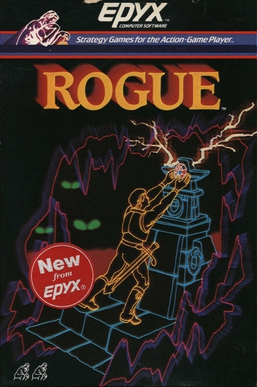
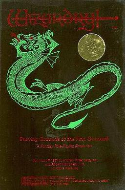
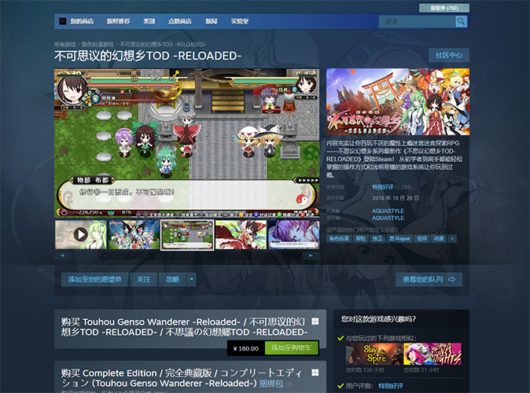

参考以下总结这些分支的游戏发展史

# 【游戏史】一类经典游戏方式的发展树
#### Game History: The Evolutionary Tree of a Classic Gameplay Style
###### GH_TETCGS

## 前言

本文梳理了基于此类 (TRPG、CRPG、基于文字游戏、模拟/沙盒与故事生成游戏、Roguelike) 游戏方式的游戏的发展历史。

条目段落字数在一定程度上表示其重要程度。

前置“-- ”的段落为直接从原文 (资料原网站) 摘取的文本，仅供参考。

***

## TRPG

桌面角色扮演游戏 ( Tabletop Role-Playing Game  缩写 TTRPG 或 TRPG ) 是所有现代RPG游戏的共同祖先。

在个人电脑诞生之前，人们通过规则书、骰子、纸笔和无限的想象力在桌面世界中进行冒险。DND奠定了职业、等级、战斗、魔法、地下城探险等核心RPG框架；COC则引入了克苏鲁神话的恐怖、调查和 sanity (理智) 系统，丰富了叙事维度。它们确定了游戏中各种对象统计数据的风格。它们的核心是 “规则下的自由叙事”。

但是我们先看看更古老的 Kriegsspiel 

### 1812 ~ 1876 Kriegsspiel (Planspiel)

  
*英国志愿军军官正在玩 Kriegsspiel ( The Graphic ，1872 年 ) *  
&nbsp;

也许 Kriegsspiel 并不算是现代叫做的 TRPG

* Reisswitz Sr. 的原型 (1812) 
* Reisswitz 规则 (1824) ——这也是最经典的规则
* Tschischwitz 规则 (1862) 
* Verdy du Vernois 的灵活方法 (1876)

-- Kriegsspiel 是普鲁士军队在 19 世纪开发的一种兵棋推演类型，用于向军官传授战场战术。 “Kriegsspiel ”一词在德语中的字面意思是“战争游戏”，但在英语中，它特指普鲁士军队在 19 世纪开发的兵棋。Kriegsspiel是第一个被军事组织用作严肃训练和研究工具的兵棋系统 。

-- 这款兵棋由年轻的普鲁士炮兵军官伯恩哈德·冯·赖斯维茨于 1824 年根据 18 世纪的战棋游戏开发而成。与之前广受欢迎的兵棋不同，这款兵棋的重点并非供大多数平民玩家娱乐，而是用于训练军官。

-- 传统形式的兵棋推演最后一次使用是在第一次世界大战之前。该规则的最后一版德文版于1914年问世。然而，从1875年起，更自由的兵棋推演形式在普鲁士逐渐确立，并很快在其他军队中也得到了推广。这些形式与原始版本的不同之处主要在于取消了骰子和棋盘，取而代之的是推演大师对战局发展的自由评估。这种自由的兵棋推演可以被视为至今仍在使用的军事沙盘游戏的前身。

  
*1824 年版本 Kriegsspiel 的复制品*  
&nbsp;

Kriegsspiel 通过棋子数量或“兵力点数”模拟军队战斗力，可视为**生命值**的雏形，同时游戏内还有**战争迷雾**的原型。

-- 该游戏在特殊的棋盘、多个 (三个) 棋盘或地图上进行。地图的使用被认为是莱斯维茨开发的变体中的一个重要创新。此外，他还引入了独立的游戏管理员，即所谓的“亲信”，他们接收参与者的棋步，并发布情况报告和战斗报告。由此，*战争迷雾*首次得以呈现。通常情况下，玩家被分为“红队”和“蓝队”，他们负责做出军事决策。助手们根据地图、军事单位的棋子 (即“兵”) 和移动范围模板执行这些决策。助手们通过掷骰子和表格来确定战斗结果，主要是伤亡人数。理想情况下，参与的三组人员在空间上相互隔离，只通过书面形式进行交流。

——<a href="https://en.wikipedia.org/wiki/Kriegsspiel">Wikipedia</a>
  

### 1974 ~ 龙与地下城 Dungeons & Dragons

  
*第五版使用的标志*  *~~他们有版权可不敢乱用~~*  
&nbsp;

  
*一款精心设计的D&D游戏正在进行中。图中展示的游戏辅助工具包括骰子、各种微缩模型以及一个地牢透视模型 *  
&nbsp;

角色扮演游戏 (role-playing game  RPG) 的奠基之作。

    发布时间
    * 1974 (初版)
    * 1977 (基本版第一修定版)
    * 1977–1979 (进阶版)
    * 1981 (基本版第二修定版)
    * 1983–1986 (基本版第三修定版)
    * 1989 (进阶版第二版)
    * 1991 (龙与地下城规则全书第四修订版)
    * 2000 (第三版)
    * 2003 (第三点五版)
    * 2008 (第四版)
    * 2014 (第五版)

-- 龙与地下城(通常缩写为D&D或DnD ) 是一款奇幻桌面角色扮演游戏(tabletop role-playing game  TTRPG)，最初由加里·吉盖克斯和戴夫·阿纳森创作和设计。该游戏于 1974 年由Tactical Studies Rules (TSR)首次出版。自 1997 年以来，它由威世智公司 (后来成为孩之宝的子公司) 出版。该游戏源自微型战争游戏，以 1971 年游戏Chainmail的变体作为初始规则系统。D&D的出版被普遍认为是现代角色扮演游戏和角色扮演游戏产业的开端，也深刻影响了电子游戏，尤其是角色扮演电子游戏类型。

-- D&D与传统的战争游戏不同，它允许每个玩家创建自己的角色来代替军事编队。这些角色在奇幻的场景中踏上冒险之旅。地下城主(DM) 担任游戏的裁判和故事讲述者，同时维护冒险发生的场景，并扮演游戏世界中的居民，即非玩家角色(NPC)。这些角色组成一个队伍，他们与场景中的居民以及彼此之间进行互动。他们一起解决问题、参与战斗、探索并收集宝藏和知识。在此过程中，玩家角色获得经验值(XP) 来升级，并在一系列单独的游戏环节中变得越来越强大。玩家在创建角色时选择一个职业，每隔几级他们就会获得特殊的津贴和能力。

#### 游戏概述

.jpg)  
*玩家在游戏过程中会使用骰子和角色表 *  
&nbsp;

-- 龙与地下城是一款结构化但开放式的角色扮演游戏。通常情况下，一名玩家扮演地下城主(DM) 或游戏管理员(GM)，其他玩家则各自控制一个角色，代表虚构场景中的个人。当玩家角色(PC)作为一个团队一起工作时，他们通常被描述为一个冒险者的“小队”，每个成员通常都有自己的专业领域，为整个团队的成功做出贡献。在游戏过程中，每个玩家都会指挥他们角色的动作以及他们与游戏中其他角色的互动。玩家通过口头模仿角色来完成此活动，同时运用各种社交和其他有用的认知技能，例如逻辑、基础数学和想象力。一场游戏通常会持续一系列会议以完成一次冒险，然后持续更长时间，形成一系列相关的游戏冒险，称为“战役”。

-- 队伍选择的结果和游戏的整体故事情节由 DM 根据游戏规则和 DM 对这些规则的解释来决定。DM 选择并描述队伍会遇到的各种非玩家角色(NPC)、这些互动发生的场景以及基于玩家选择和行动的遭遇结果。遭遇通常以与“怪物”战斗的形式出现——怪物是D&D中用来描述潜在敌对生物 (如动物、异常生物或神话生物) 的通用术语。除了珠宝和金币外，魔法物品也是玩家经常在地下城中寻找的宝藏的一部分。魔法物品通常可以在宝藏中找到，或者从倒下的对手身上找回；有时，强大或重要的魔法物品是任务的目标。游戏规则详尽，涵盖社交互动、魔法使用、战斗、以及环境对玩家角色的影响等诸多主题，帮助 DM 做出这些决定。DM 可以选择偏离已发布的规则，或者在必要时制定新的规则。

-- 最新版本的游戏规则详细说明在五版的三本核心规则书中： 玩家手册 、 地下城主指南 和 怪物图鉴 。

-- 玩游戏所需的物品只有规则书、每位玩家的角色卡以及一些多面骰子。许多玩家还会在网格地图上使用微型人物作为视觉辅助，尤其是在战斗中。某些版本的游戏预设了这种用法。许多可选配件可以增强游戏体验，例如扩展规则书、预先设计的冒险和各种战役设定。

#### 游戏机制

  
*D&D使用多面骰子来解决游戏事件。多面骰子以字母“d”缩写，后跟面数。从左到右依次为 d20、d12、d%、d10、d8、d6 和 d4。d% 和 d10 可以一起掷出 1 到 100 之间的数字 *  
&nbsp;

-- 游戏开始前，每位玩家都会创建自己的角色，并将详细信息 (如下所述) 记录在角色卡上。首先，玩家确定角色的属性值，包括力量、敏捷、体质、智力、感知和魅力。游戏的每个版本都提供了不同的计算方法。然后，玩家选择种族 (例如矮人、精灵或人类——在第五纪元2024年之前称为“种族”) ，角色职业 (例如战士、盗贼或法师) ，阵营 (道德和伦理观) ，以及其他一些特征，以完善角色的能力和背景故事。这些特征在不同版本中会有所差异。

-- 在游戏过程中，玩家向 DM 描述其 PC 的预期行动，DM 然后描述结果或响应。诸如捡起一封信或打开一扇未上锁的门之类的琐碎动作通常会自动成功。而诸如攀爬悬崖或撬锁之类的更复杂或更危险的动作的结果则通过掷骰子来决定。不同的多面骰子用于不同的动作。例如，二十面骰子用于确定战斗中是否命中，而四面、六面、八面、十面甚至十二面骰子则用于确定造成的伤害量。影响结果的因素包括角色的能力值、技能和任务的难度。当角色试图避免负面结果时，例如躲避陷阱或抵抗法术效果时，可以使用豁免检定来确定是否减少或避免由此产生的效果。 在这种情况下，成功率受角色的职业、等级和能力值影响。 当角色尝试完成诸如撬锁、解除陷阱或推巨石等任务时，必须达到或超过相应的难度等级。系统会添加相应的能力加成，以帮助玩家成功。

-- 随着游戏的进行，每个角色都会发生变化，能力通常会增强。角色会获得 (有时也会失去) 经验、技能和财富，甚至可能改变阵营或获得额外的角色职业，这被称为“兼职”。角色进步的关键方式是获得经验值(XP)，经验值会在击败敌人或完成艰巨任务时获得。获得足够的经验值可以让角色升级，从而提升角色的职业特性、能力和技能。在某些情况下，例如遭遇吸取生命能量的生物，或使用某些需要消耗经验值的魔法力量，可能会损失经验值。

#### 生命值的基本确定
1974年DnD初版引入“生命骰” (Hit Dice) 概念，玩家通过掷骰决定角色的初始生命值，标志着生命值从军事模拟转向个体角色管理。这种设计通过随机性与成长性 (如升级增加HP) 增强了叙事沉浸感。

-- 生命值(HP) 是衡量角色生命力和健康状况的指标，由每个角色的职业、等级和体质决定。角色在战斗中受伤或受到其他伤害时，可能会暂时失去生命值，而失去生命值是游戏中角色死亡的最常见原因。失去关键属性值或角色等级也可能导致死亡。角色死亡后，通常可以通过魔法复活，但可能会受到一些惩罚。如果无法复活或不想复活，玩家可以创建一个新的角色继续游戏。

-- 在原版D&D游戏中，角色的生命值达到 0 时即死亡。第一版AD&D引入了一条可选规则，规定角色的生命值达到 -10 时即死亡，生命值为 0 时生物会失去意识，生命值降至负值的生物会因流血等原因继续损失生命值，除非通过辅助或治疗 (自然疗法或魔法疗法) 稳定下来。

——<a href="https://en.wikipedia.org/wiki/Dungeons_%26_Dragons">Wikipedia</a>
  

### 1981 ~ 克苏鲁的呼唤 Call of Cthulhu

  
*克苏鲁的呼唤标志*  
&nbsp;

-- Call of Cthulhu 是一款恐怖角色 扮演游戏，改编自霍华德·洛夫克拉夫特的同名故事及其相关的克苏鲁神话。该游戏通常缩写为CoC ，由Chaosium发行；它于 1981 年首次发行，目前已发行至第七版，并发行了获得授权的外语版本。其游戏系统基于 Chaosium 的基础角色扮演系统(BRP)，并添加了针对恐怖类型的内容。这些内容包括关于理智和运气的特殊规则。

  
*第一版盒盖由 Gene Day 设计，1981 年*  

    发布时间
    1981 (第一版)
    1983 (第二版)
    1986 (第三版)
    1989 (第四版)
    1992 (第五版)
    1998 (版本 5.5)
    1999 (版本 5.6)
    2001 (版本 5.6.1)
    2001 (20周年纪念版)
    2004 (第六版)
    2014 (第七版)

-- 对于深谙角色扮演游戏传统的玩家来说， CoC 的首发便为桌游开辟了全新的框架。不同于 DnD所确立的传统模式，角色们通常需要在洞穴或隧道中穿梭，与不同类型的怪物战斗，桑迪·彼得森引入了“洋葱皮”的概念：层层交织的信息和层层嵌套的线索，引导玩家角色从看似微不足道的失踪人员调查，逐渐发现令人麻木的、旨在毁灭世界的全球阴谋。与前作不同，CoC 假设大多数调查员无法生存，无论是活着还是保持理智，而应对规则书中描述的绝大多数棘手问题的唯一安全方法就是逃跑。一场运作良好的 CoC 战役应该在玩家心中营造一种不祥的预感和不可避免的厄运。游戏的风格和设定在相对现代的时代背景下，强调了现实生活场景、人物研究以及思考解决问题的方法。

#### 游戏机制

-- CoC 使用最初为RuneQuest开发并在其他 Chaosium 游戏中使用的基本角色扮演系统。该系统基于技能，玩家角色只要保持健康和理智，就能通过成功使用技能来提升技能。然而，他们不会获得生命值，也不会变得更加难以被杀死。游戏不使用等级。

-- CoC 使用百分骰子 (结果范围从 1 到 100) 来判定成功或失败。所有玩家统计数据都旨在与玩家能力范围内特定行动的成功概率相符。例如，一位艺术家可能有 75% 的概率能够画出一幅画 (以艺术技能 75 表示) ，因此掷出低于 75 的点数即为成功。掷出技能等级的1/5或更低 (例如1-15 ) 的点数即为“特殊成功” (或战斗技能的“刺穿”) ，并会获得由守护者决定的额外奖励。例如，艺术家角色可能画得特别好或特别快，或者捕捉到了画中一些不明显的细节。

-- 玩家扮演被卷入神秘领域的普通人：侦探、罪犯、学者、艺术家、退伍军人等等。通常，事情的开端看似平淡无奇，但幕后真相逐渐被揭露。随着角色逐渐了解世间的真正恐怖以及人性的无足轻重，他们的理智 (用“**理智点数**” (Sanity Points，简称*SAN*) 表示) 不可避免地会逐渐消亡。游戏内置了一种机制，用于判断角色在特定时刻的理智受损程度；遭遇恐怖生物通常会导致SAN点数的损失。为了获得击败恐怖生物所需的工具——神秘知识和魔法——角色最终可能会失去部分理智，但也存在其他方法，例如纯粹的火力攻击或智胜对手。CoC 以一款游戏而闻名，在这种游戏中，玩家角色在可怕的情况下死亡或最终被送进精神病院是很常见的。玩家最终能否获胜并非板上钉钉。

——<a href="https://en.wikipedia.org/wiki/Call_of_Cthulhu_(role-playing_game)">Wikipedia</a>
  

***

## 图声稀少的 基于文字游戏/互动小说 Based on text
### 1977 Zork

  
*Zork在Kaypro CP/M电脑上玩*

  
*1977 年Zork世界的地图，由 Aaron A. Reed 为“50 年文字游戏”项目绘制*  
&nbsp;

-- Zork是一款基于文本的冒险游戏，由开发人员Tim Anderson、 Marc Blank、 Bruce Daniels和Dave Lebling于 1977 年首次为PDP-10 大型计算机发布。在Zork中，玩家探索废弃的伟大的地下帝国寻找宝藏。玩家在游戏中的数百个地点之间移动，并通过输入游戏可以解释的自然语言命令来与物体互动。该程序充当叙述者，描述玩家的位置和玩家命令的结果。它被描述为最著名的互动小说。  

-- 玩家需要输入文本命令，让角色穿越各个地点、解开谜题并收集宝藏。游戏中有数百个地点，每个地点都有名称和描述，玩家的命令会与其中的物体、障碍物和生物互动。命令可以是一两个单词 (例如，“拿灯”或“北”) ，也可以是更复杂的短语 (例如，“把灯和剑放进盒子里”) 。命令必须符合地点的上下文 (例如，“拿灯”只有在有灯的情况下才有效) 。程序充当叙述者的角色，向玩家描述他们的位置以及某些操作的结果。如果游戏无法理解玩家的命令，它会要求玩家重新输入操作。程序的回复通常带有讽刺意味的对话语气，就像游戏管理员在桌面角色扮演游戏中引导玩家时使用的语气一样。

——<a href="https://en.wikipedia.org/wiki/Zork">Wikipedia</a>
  

### 1998 Anchorhead

  
*Anchorhead 电脑游戏截图*  
&nbsp;

-- Anchorhead 是一款洛夫克拉夫特式恐怖 互动小说 游戏，最初由迈克尔·S·金特里 (Michael S. Gentry) 于 1998 年创作并出版。游戏深受霍华德·洛夫克拉夫特作品和写作风格的，尤其是克苏鲁神话。  

-- Anchorhead 的故事发生在新英格兰一个虚构的同名小镇。一位匿名的主角和她的丈夫——一位教授兼作家——为了继承他祖传的宅邸而迁居于此。通过对小镇及其丈夫家族的历史调查，主角发现了一个阴谋，即举行一个仪式来召唤旧日支配者，并使星球陷入危险。主角必须阻止仪式的进行并拯救她的丈夫。游戏故事持续三天，前两天为整天，第三天则分为多个部分。前两天没有时间限制；每天在玩家完成一项或多项必需任务后结束。只有在第三天，游戏才会限制玩家解开必要谜题所需的回合数。  

-- Anchorhead 因其错综复杂的背景故事以及精彩的对话和描写，被评论家和玩家誉为最佳互动小说游戏之一。在1998年的XYZZY游戏奖中，Anchorhead 荣获最佳设定奖，并被提名为最佳游戏奖。

——<a href="https://en.wikipedia.org/wiki/Anchorhead">Wikipedia</a>
  

### Wardim: The Realm of Aslona ——2022 12 21
### Corruption of Champions
### Broken Dreams Correctional Center
### HTML引擎Twine

***

## 模拟、沙盒和故事生成器 Simulate & Sandbox & Story Generator
### Rogue ——1980

  
*Rogue封面*  
&nbsp;

-- Rogue ( 也称 Rogue: Exploring the Dungeons of Doom ) 是一款地下城探索类 视频游戏，由 Michael Toy 和Glenn Wichman开发， Ken Arnold后来也参与。  

-- 在 Rogue 中，玩家控制一个角色探索地下城的多个层级，寻找位于地下城最底层的 Yendor 护身符。玩家角色必须击退在地下城中游荡的怪物。一路上，玩家可以收集有助于进攻或防守的宝藏，例如武器、盔甲、药水、卷轴和其他魔法物品。 Rogue 采用回合制游戏，在以ASCII或其他固定字符集表示的方格网格上进行游戏，让玩家有时间确定最佳的生存策略。 Rogue 采用永久死亡的设计，使玩家的每次行动都具有意义——如果玩家角色在战斗或其他原因中失去所有生命值，则该角色死亡。玩家必须以新角色重新开始游戏，因为死亡的角色无法重生，也无法通过从保存状态重新加载来复活。此外，每个游戏都独一无二，因为地下城层级、怪物遭遇和宝藏都是在每次游戏中程序生成的。  

-- 玩家角色是一位冒险者。游戏从一座未知地牢的最上层开始，那里有无数的怪物和宝藏。玩家的目标是一路杀到最底层，取回岩多护身符 (“Rodney”的拼写要倒过来) ，然后上升到地面。层层递进的怪物难度逐渐增加。在取回护身符之前，玩家无法返回之前的层级。

#### 用户界面

*1980 年版本中程序生成的地下城*  
&nbsp;

-- 在最初的文本版本中，游戏的各个方面，包括地下城、玩家角色和怪物，都由ASCII字符集中的字母和符号表示。怪物用大写字母表示 (例如Z，代表僵尸) ，因此有 26 种。这种显示方式使其适用于非图形终端。 Rogue 的后续移植版本将扩展字符集应用于文本用户界面，或将其替换为图形块。

-- 基本移动键 (h ，向左；j，向下；k，向上；l ，向右) 与vi编辑器中的光标控制键相同。其他游戏操作也使用单个按键—— q表示喝药水，w表示使用武器，e表示进食，等等。在DOS版本中，光标键用于指定移动，快速移动键 (H、J、K和L ) 被滚动锁定键取代。

-- 每个地下城层级都由一个三室三厅的网格构成 (可能) ；有时，在原本应该有房间的地方，会出现死胡同、T字形岔路或弯曲的通道。较低层级的房间可能会变成迷宫。与原始设计时期的大多数冒险游戏不同，地下城的布局和其中物品的摆放都是随机生成的。

——<a href="https://en.wikipedia.org/wiki/Rogue_(video_game)">Wikipedia</a>
  

### 2006 ~ 矮人要塞 Dwarf Fortress ——2006 8 8
### 2004? ~ Elona ——官网 2004 ——英文wiki 2008 5
### 2011 ~ 我的世界 Minecraft ——2011 11 18
### 2010 ~ Cataclysm: Dark Days Ahead 
年份为查到 GitHub仓库首次提交日期 2010 10 4

### 2018 ~ 环世界 Rimworld ——2018 10 17
  * DLC  Royalty ——2020 2 24
  * DLC  Ideology ——2021 7 21
  * DLC  Biotech ——2022 10 21
  * DLC  Anomaly ——2024 4 12
  * DLC  Odyssey ——2025 7 11
### Moonring ——2023 9 29

***

## 迷宫探索

迷宫探索 的游戏通常也含有 CRPG 和 团队角色扮演 ( Team Role-Playing Game ) 标签，不过迷宫探索依然是核心 Gameplay 和主题。

迷宫探索 游戏的核心是迷宫，也局限在了迷宫。从纸面游戏的走迷宫，到现在的电子游戏，形态为迷宫的地图样子差异不大，它天生带有跨作品的重复性。即使流程短的游戏，也会在那两个小时的走格子中失去耐心。

先从现代 CRPG 鼻祖的 Wizardry 系列看起。

### 1981 ~ 2024 Wizardry

  
*Wizardry logo*  
&nbsp;

-- Wizardry 是一系列角色扮演类电子游戏，最初由美国出版商 Sir-Tech 制作。该系列与 Ultima 和Might and Magic 一起对现代角色扮演类电子游戏的发展产生了影响。最初的 Wizardry 对早期的主机角色扮演游戏产生了重大影响，例如 真女神转生、屠龙勇士、光明系列、火焰纹章、最终幻想 和 勇者斗恶龙。该游戏最初为 Apple II 制作，后来被移植到其他平台。Sir-Tech 原创系列的最后一款游戏是 2001 年发行的 Wizardry 8。此后，日本市场开发了各种衍生游戏。

-- Wizardry 最初是由 安德鲁·C·格林伯格（Andrew C. Greenberg）和 罗伯特·伍德黑德（Robert Woodhead ）创作的一款简单的地下城探索游戏。游戏编写于他们在康奈尔大学读书期间，由 Sir-Tech 出版。该游戏受到了柏拉图系统早期游戏的影响，最著名的是 地下城 （ Oubliette ）。 Wizardry 的早期作品非常成功，因为它们是首批在家用电脑上以丰富的画面呈现 龙与地下城 式游戏玩法的作品。首个版本的发布恰逢 龙与地下城 在北美的第一波流行浪潮。

-- 系列的前五部游戏是用 Apple Pascal （ UCSD Pascal的一个实现）编写的。通过为目标机器编写 UCSD Pascal 实现（Mac II交叉开发），它们被移植到许多不同的平台上。

-- 2024年5月， 巫术：疯狂霸主的试炼场 的3D重制版在现代平台上发布，其名称与原作相同。该重制版由Digital Eclipse开发，该公司此前并未参与 Wizardry 系列的开发。

-- Datamost发布了菜单驱动的WizPlus，这是一款实用程序，允许用户更改 Wizardry 中的角色和游戏环境；Bob Reams 在 电脑游戏世界 上评论了这款实用程序，并表示“使用WizPlus时应格外谨慎，否则冒险精神会被削弱，更重要的是，你将无法继续玩这个激动人心的系列游戏”。
&nbsp;

主系列发布时间 ( 北美 )  

* 1981年9月 (Apple II) Wizardry: Proving Grounds of the Mad Overlord
* 1982年（Apple II） Wizardry II: The Knight of Diamonds
* 1983年（Apple II） Wizardry III: Legacy of Llylgamyn
* 1987年（Apple II） Wizardry IV: The Return of Werdna
* 1988年（Apple II） Wizardry V: Heart of the Maelstrom
* 1990年（Amiga，MS-DOS） Wizardry VI: Bane of the Cosmic Forge
* 1992年10月（MS-DOS） Wizardry VII: Crusaders of the Dark Savant
* 2001年11月14日（PC） Wizardry 8

——<a href="https://wizardry.info/en/">Wizardry</a>
  

——<a href="https://en.wikipedia.org/wiki/Wizardry_(video_game_series)#American_spin-off_game">Wikipedia</a>
  

#### 1981 巫术：疯狂霸主的试炼场 Wizardry: Proving Grounds of the Mad Overlord

  
*Apple II 封面*  
&nbsp;

**游戏玩法**

-- 玩家从城镇出发（城镇仅以文本菜单的形式呈现），创建一个最多六名角色的小队，角色可选五种种族（人类、精灵、矮人、侏儒、霍比特人）、三种阵营（善良、中立、邪恶）和四种基础职业（战士、牧师、法师、盗贼），以及四种精英职业（主教：拥有牧师和法师法术；武士：拥有法师法术的战士；领主：拥有牧师法术的战士；忍者：拥有盗贼能力的战士），这些精英职业在角色达到一定等级后解锁。善良角色和邪恶角色通常不能分配到同一个小队。

-- 角色装备好基础护甲和武器后，队伍将下降到特雷博城堡下方的地牢。这里是一个十层迷宫，每一层都比上一层更具挑战性。职业拥有多个法术，每个法术有七个等级，角色随着等级提升可以学习这些法术。

-- 这款游戏的玩法被称为“地下城探索”。其目标与大多数后续角色扮演电子游戏一样，是寻找宝藏，包括越来越强大的物品，通过击杀怪物获得经验值，然后在底层对抗邪恶的大巫师维尔德纳，夺取强大的护身符。大多数关卡的目标是找到通往下一层的电梯或楼梯，并且不被击杀。

  
*IBM PC 上 巫术 I 在迷宫第一层的截图*  
&nbsp;

-- 以今天的标准来看，原版游戏的画面极其简陋；大部分屏幕都被文字占据，约10%的屏幕空间用于以第一人称视角呈现的地下城迷宫，并使用线条图形。然而，以当时的标准来看，原版游戏的画面比当时更为常见的纯文字游戏有所改进。

-- 遇到怪物时，地下城迷宫会消失，取而代之的是其中一只怪物的图片。战斗对象为1至4组怪物。游戏缺乏自动地图功能（该功能在游戏发布时尚未发明），这实际上迫使玩家在方格纸（包含在盒子中）上绘制每个关卡的地图，并一步步穿过20x20的地下城迷宫——如果不这样做，通常会导致永久迷路，因为迷宫中的许多位置都会被永久施加“黑暗”咒语（使玩家盲目行走）或“传送”咒语，将玩家传送到新的位置。可以使用魔法咒语来确定队伍的当前位置，在更高级别，还有一个传送咒语可用于在迷宫关卡之间快速切换。传送时必须小心，因为玩家必须输入要传送到的关卡和坐标（从当前位置向北、向南、向东或向西的步数），并且很容易落入陷阱或坚硬的石头中，从而结束游戏。 巫术 的原版游戏也不会宣布玩家已经传送，游戏会继续进行，就像玩家向前迈了一步一样。

-- 游戏难度极高，玩家无法在地下城内保存进度，必须先离开地下城。如果队伍成员全部阵亡，游戏将无法继续；不过，新的队伍可以捡回死去冒险者的尸体和物品。后来的巫术游戏为了让游戏更容易，会从地下城中角色死亡的位置重新开始。通关游戏可能需要数百小时。

-- 巫术 会将玩家的队伍和游戏进度保存到场景磁盘中。启动后，可以使用空白软盘或现有软盘创建新的场景磁盘。完成“疯狂霸主的试炼场”后，玩家可以将获胜队伍导出到 巫术 II 和 巫术 III 。

——<a href="https://en.wikipedia.org/wiki/Wizardry:_Proving_Grounds_of_the_Mad_Overlord">Wikipedia</a>
  

### 1993 ~ 日式 不可思议的迷宫

  
*宝可梦不可思议的迷宫 中使用的不可思议的迷宫标志；每个系列都有不同的标志*  
&nbsp;

-- 不可思议的迷宫，在日本被称为不思议的迷宫，是一系列roguelike 角色扮演视频游戏。大多数游戏由Chunsoft (2012 年合并后更名为 Spike Chunsoft) 开发，部分游戏由其他公司在 Chunsoft 许可下开发。该系列始于勇者斗恶龙的共同创作者中村浩一受到长畑诚一郎的Rogue经验启发 (他也是该公司的开发者) 并希望创建一个原创系列。它始于超级任天堂，随后发展到几乎所有任天堂和索尼的家用和掌上游戏机、 WonderSwan、 Dreamcast、 Windows和移动设备。

-- 该系列在日本启发了其他作品，并颇具人气，主要来自与 勇者斗恶龙 、 陆行鸟 和 宝可梦不可思议的迷宫 系列的联动作品。尽管该系列人气不高，但旗下已出版了众多漫画、动画和小说，无论是出自该公司的原创系列 风来的西林 ，还是众多联动作品。

-- 大多数不可思议的迷宫游戏的设定都是让一位沉默的主角游历世界各地，探索神秘的迷宫。这些迷宫的房间随机生成，即使多次进入也不会重复相同的模式。主角有时会与一群小队成员同行，有时独自一人。虽然该系列相对上受到了NetHack等较老的 roguelike 游戏的启发，但也有一些独特的游戏元素会在未来的游戏中出现；其中之一就是通过生成的密码在线拯救其他玩家。自 1993 年首次亮相以来，该系列凭借其具有挑战性但回报丰厚的难度以及对铁杆 RPG 粉丝的吸引力，一直拥有大量忠实粉丝。

-- 虽然该系列所有游戏都在日文标题中带有 不可思议的迷宫 的称号，但只有 风来的西林 游戏包含原创角色；所有其他游戏的角色都来自其他角色扮演游戏系列。第一款游戏 托尔尼克的大冒险 以同一开发商的 勇者斗恶龙 IV 中的店主角色为主角。Chunsoft 还推出了几条品牌不可思议的迷宫游戏生产线，首先是1997 年SquareSoft的 最终幻想 系列中的陆行鸟，然后是万代的 高达 、Konami的TwinBee和Namco的 迷宫之塔 系列 (2004 年) 、Game Freak的 神奇宝贝 系列 (2005 年) 和Atlus的 世界树的迷宫 系列 (2015 年) 。目前， 单行道英雄 是与该系列的最新交叉游戏。多年来，还出现了其他非该公司开发或发行但使用相同名称的游戏，即 东方Project 系列及其衍生产品 不思议的幻想乡 。

  
*Steam上的 不可思议的幻想乡TOD -RELOADED-*  
&nbsp;

就连东方都有不可思议的迷宫，可见这个类型的生命力。

不过， 不可思议的迷宫 的 Gameplay 天生具有缺陷，其中所谓 不会重复相同的随机生成的迷宫 是重复度最高的部分。系列偏执的坚持 Rogue 的房间与路径的节点式地图，或者路径崎岖导致的迷宫式地图，这种重复是跨游戏作品的。

Elona 和 Elin 作为同样日本作品，其中的地下城部分与 不可思议的迷宫 的主要游玩场景极为相似，或者说就是参考它制作的。地下城部分游戏性要比 不可思议的迷宫 高出不少，世界互动性丰富，这是大多数不可思议的迷宫作品没有的，而在这些作品中，这个游戏部分就是整个游戏的全部了。其他的装备、物品、合成系统只是添头，并且很多作品的这些内容填充部分并没有做好。

&nbsp;

勇者斗恶龙系列

* 1993年：特鲁尼克大冒险 不可思议迷宫 – 超级任天堂
* 1999年：特鲁尼克大冒险2 不可思议迷宫 – PlayStation；2001年重制于Game Boy Advance
* 2002年：特鲁尼克大冒险3 不可思议迷宫 – PlayStation 2；2004年重制于Game Boy Advance
* 2006年：勇者斗恶龙 少年杨格斯与不可思议迷宫 – PlayStation 2；由cavia, inc.开发
* 2006年：勇者斗恶龙 不可思议迷宫 Mobile – NTT docomo、au、Yahoo!
* 2009年：勇者斗恶龙 更不思议的迷宫 Mobile – NTT docomo、au

风来的西林系列

* 1995年：不可思议迷宫 风来的西林 – 超级任天堂；2006年重制于任天堂DS
* 1996年：BS 风来的西林 スララを救え - Satellaview
* 1996年：不可思议迷宫 风来的西林GB 月影村的怪物 – Game Boy；1999年重制于Windows
* 2000年：不可思议迷宫 风来的西林2 鬼袭来!席连城! – Nintendo 64
* 2001年：不可思议迷宫 风来的西林GB2 沙漠魔城 – Game Boy Color；2008年重制于任天堂DS (不可思议迷宫 风来的西林DS2 沙漠魔城) 
* 2002年：不可思议迷宫 风来的西林外传 女剑士飞鸟参见! – Dreamcast；2002年重制于Windows
* 2008年：不可思议的迷宫 风来的西林3 机关宅邸的睡美人 – Wii；2010年重制于PlayStation Portable
* 2010年：不可思议的迷宫 风来的西林4 plus 神之眼和恶魔之脐 – 任天堂DS；2012年重制于PlayStation Portable
* 2010年：不可思议的迷宫 风来的西林5 plus 命运塔与命运的骰子 - 任天堂DS；2015年重制于PlayStation Vita；2020年重制于Nintendo Switch，Windows
* 2024年：不可思议的迷宫 风来的西林6 蛇蜷岛探险谭 - Switch

陆行鸟系列

* 1997年：陆行鸟的不可思议迷宫 – PlayStation；1999年重制于WonderSwan；史克威尔开发
* 1998年：陆行鸟的不可思议迷宫2 – PlayStation；史克威尔开发
虽然由史克威尔开发，但上面两部作品均由Chunsoft总裁中村光一监督。
* 2008年：陆行鸟的不思议迷宫 忘却时间的迷宫 - Wii；h.a.n.d.开发
* 2008年：希德与陆行鸟的不思议迷宫 忘却时间的迷宫DS+ - 任天堂DS；h.a.n.d.开发
* 2019年： 陆行鸟的不可思议迷宫 Everybody！ - Nintendo Switch及PlayStation 4

宝可梦系列

* 2005年：宝可梦不可思议迷宫 赤之救助队·青之救助队 – 任天堂DS和Game Boy Advance
* 2007年: 宝可梦不可思议迷宫 黄金之救助队 - PC
* 2007年：宝可梦不可思议迷宫 时之探险队·暗之探险队 – 任天堂DS
* 2009年：宝可梦不可思议迷宫 空之探险队 - 任天堂DS
* 2009年：宝可梦不可思议迷宫 冒险团系列 - WiiWare
* 2012年：宝可梦不可思议迷宫 伟大之门与∞迷宫 - 任天堂3DS
* 2015年：宝可梦超级不可思议迷宫 - 任天堂3DS
* 2020年：宝可梦不可思议迷宫 救助队DX - 任天堂Switch

——<a href="https://en.wikipedia.org/wiki/Mystery_Dungeon">Wikipedia</a>
  

***

## CRPG

电脑角色扮演游戏 ( Computer Role-Playing Game )

现代 CRPG 通常指保留传统 TRPG 叙事风格和自由度的角色扮演游戏，如 辐射4 和 上古卷轴5 就不那么CRPG。

巫术、创世纪、魔法门 一起被认为是 CRPG 游戏类型的典范。

### 1981 ~ 2018 创世纪 Ultima

  
*该系列中最常用的标志*  
&nbsp;

-- Ultima 是起源系统公司（Origin Systems）推出的一系列开放世界 奇幻 角色扮演类电子游戏，由理查德·加里奥特（Richard Garriott）创作。美国艺电公司（Electronic Arts）自1992年起拥有该品牌。截至1997年，该系列已售出超过200万份。

-- 该系列多部作品被视为其类型中的开创性典范，早期作品尤其引入了诸多创新机制，后被众多游戏广泛效仿。

-- Ultima 系列主要以奇幻小说为背景，同时融入科幻元素。故事主要发生在名为不列颠尼亚的世界中。

-- Ultima 系列主线由九部作品组成（第七部分为两部分），分为三个三部曲，或称“时代”：黑暗时代（创世纪 I-III）、启蒙时代（创世纪 IV-VI）和末日时代（创世纪 VII-IX）。 末日时代有时也因其主要反派而被称为“守护者传奇” 。 第一部三部曲设定在一个名为索萨利亚的奇幻世界，但在黑暗时代的灾难性事件中，索萨利亚被分裂，四分之三的世界消失了。 剩下的部分被称为不列颠尼亚，一个由仁慈的不列颠领主统治的国度，也是后期游戏的主要发生地。 所有游戏的主角都是地球居民，他受不列颠领主之命保护索萨利亚以及后来的不列颠尼亚免受各种危险。最初，玩家角色被称为“陌生人”，但在 创世纪 IV 的结尾，他被普遍称为“阿凡达”。
&nbsp;

    发布时间
    1980 Akalabeth
    1981 Ultima I: The First Age of Darkness
    1982 Ultima II: The Revenge of the Enchantress
    1983 Ultima III: Exodus
    1985 Ultima IV: Quest of the Avatar
    1988 Ultima V: Warriors of Destiny
    1990 Ultima VI: The False Prophet 
    1992 Ultima VII: The Black Gate
    1993 Ultima VII Part Two: Serpent Isle
    1994 Ultima VIII: Pagan
    1999 Ultima IX: Ascension

——<a href="https://en.wikipedia.org/wiki/Ultima_(series)">Wikipedia</a>
  

#### 1981 创世纪 I：黑暗时代 Ultima I: The First Age of Darkness

  
*1986 年版的封面艺术*  
&nbsp;

Ultima 围绕着寻找并摧毁不朽宝石的任务展开。邪恶巫师蒙丹正利用这颗宝石奴役索萨里亚的土地。由于拥有这颗宝石，他无法被杀死，他的爪牙四处游荡，恐吓着这片土地。玩家将扮演“陌生人”，一个从异世界召唤而来，旨在终结蒙丹统治的人。[ 3 ]游戏讲述了这位陌生人在完成任务过程中的种种努力，其中包括探索地牢和太空旅行等诸多游戏元素。[ 4 ]

**游戏玩法**

——<a href="https://en.wikipedia.org/wiki/Ultima_I:_The_First_Age_of_Darkness">Wikipedia</a>
  

### 1986 ~ 2014 魔法门 Might and Magic

-- 魔法门 是一系列科幻奇幻类角色扮演电子游戏，由新世界计算机公司（New World Computing）开发，该公司于1996年成为3DO公司的子公司。最初的 魔法门 系列随着3DO公司的倒闭而终结。育碧以130万美元购得了“魔法门”的命名权 ，并重启了该系列，推出了一个与前作毫无关联性的新系列，首作是 魔法门英雄传V 和 魔法门英雄传黑暗弥赛亚 。

### 日式 RPG

#### 1987 ~ 2025 女神转生
#### 
#### 
#### 

### 无冬之夜
### 博德之门
### 辐射12  3 新维加斯 4
### 上古卷轴
### 潜行者
### Peripeteia ——2025 2 22

***

## Roguelike & Roguelite
### 以撒的结合 The Binding of Isaac ——2011 9 29
### 盗贼遗产 Rogue Legacy ——2013 6 28
### 以撒的结合：重生 The Binding of Isaac: Rebirth ——2014 11 5
### 废土之王 Nuclear Throne ——2015 12 6
### 挺进地牢 Enter the Gungeon ——2016 4 5
### 以撒的结合：忏悔+ The Binding of Isaac: Repentance+ ——2024 11 19

***

## 快节奏时代 The fast-paced era
### 杀戮尖塔 Slay the Spire ——2019 1 23
### 卡牌Roguelike
### 吸血鬼幸存者 Vampire Survivors ——2022 10 21
### 幸存者like

***

## 又老又新 Old yet new
### 矮人要塞  ——steam版本 2022 12 6
### Cataclysm: Dark Days Ahead  ——steam版本 2023 3 31
### Elin ——2024 11 1

## 关于

所有引用文本、资源，在相关条目后标有原网站链接。
前置“-- ”的段落为直接从原文 (资料原网站) 摘取的文本，我不保有任何权利。
除特殊标识以外的引用图像资源均是从原文 (资料原网站) 摘取的，我不保有任何权利。